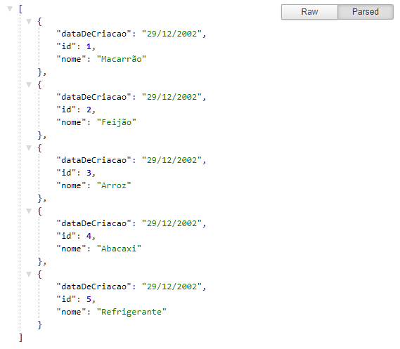

# Projeto: Inventário WebAPI

  <a href="#sobre">Sobre o Projeto ℹ️</a>&nbsp;&nbsp;&nbsp;
  <a href="#tecno">Tecnologias 🚀</a>&nbsp;&nbsp;&nbsp;
  <a href="#instrucoes">Instruções / Tutorial 🎓</a>&nbsp;&nbsp;&nbsp;
  <a href="#referencias">Referências 🔗</a>  

 

### Sobre ℹ️

Projeto wEB API de um inventário usando Python e frame Flask 

[Voltar ⬆️](#indice)

 

### Tecnologias 🚀

- Python 

- Flask

[Voltar ⬆️](#indice)

 

### Instruções / Tutorial 🎓

 

#### Como Clonar

* Faça **fork** do projeto

* Escolha a url para clone e copie

* Em seu terminal, execute o comando complentando a url clone

      git clone urlExemplo

#### Executando Web API

* Com seu terminal, entre na pasta raiz do projeto e ative o script da máquina virtual:

  > Para Windows e usando terminal PowerShell

      venv\Scripts\activate

* Depois da ativação execute o arquivo **"main.py"**:

      python main.py

>*NOTA:* A executação pode ser realizada com auxílio de uma IDE, contudo é importante que reconheçam o arquivo **"main.py"** para execução. 

 

#### Como consumir a WebAPI

 

##### LIstar

- Após inicializar WebAPI, acesse a url para obter a lista

      http://127.0.0.1:5000/produtos

  

##### Cadastrar

- Envie na url:

      http://127.0.0.1:5000/produto-add

 O corpo de resposta com **nome** e **dataDeCriacao** de um  produto.

Exemplo:

      {
        “nome”: “Manteiga”, 
        “dataDeCriacao”: “12/11/2022”
      }

[Voltar ⬆️](#indice)

 

### Referências 🔗

- Como criar uma Api com Flask + Python - #019 - Api Rest com Python + Flask - [PycodeBR](https://www.youtube.com/watch?v=LP8besicfH4)

[Voltar ⬆️](#indice)
